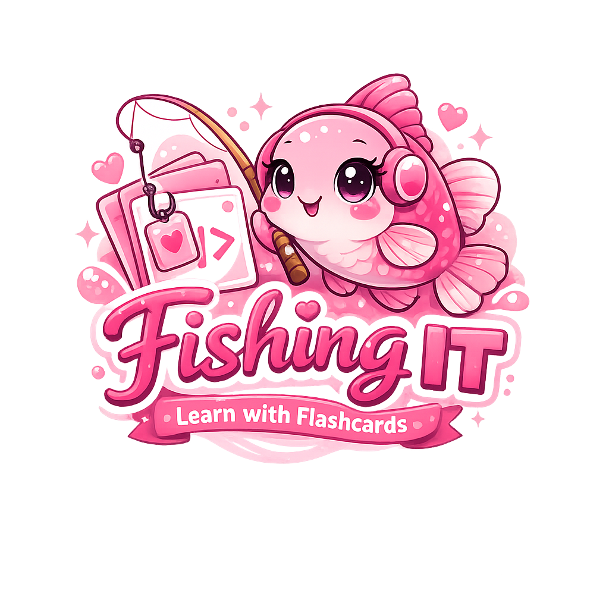

<p align="center">
  
</p>

<p align="center">
  <strong>Catch a question. Learn something new.</strong><br>
  A flashcard app for studying programming concepts, one card at a time.
</p>

<p align="center">
  
  
  
  
</p>

## About

FishingIT is a personal learning project built with Python, Flask, SQLite, and vanilla JavaScript. It brings flashcard decks, self-assessment, and saved study progress together in a simple browser interface.

The interface is currently in Polish. Cards can contain questions and answers in any language, including programming examples formatted with Markdown.

## Features

- **Study by deck** — keep related questions together.
- **Reveal answers** — try to recall the answer before checking it.
- **Track your progress** — mark cards as mastered or needing practice, or skip them.
- **Resume learning** — review cards that have not been mastered yet.
- **Start fresh** — reset a deck's progress and study the whole set again.
- **Shuffle cards** — get a new order for each study session.
- **See a session summary** — view counts and a chart of card statuses.
- **Use Markdown** — include headings, lists, links, emphasis, and code blocks in questions and answers.
- **Import your own decks** — submit flashcards as JSON through the API.
- **Delete decks** — remove a deck and its cards from the library.

Progress is stored in SQLite and persists between app restarts. The current app uses a shared library and progress, without separate user accounts.

## Run locally

You need **Python 3.13 or newer**, **Git**, and **[uv](https://docs.astral.sh/uv/getting-started/installation/)**.

Clone the repository and install its dependencies:

```bash
git clone https://github.com/magicpaperbox/fishing-it.git
cd fishing-it
uv sync --frozen
```

Start the development server:

```bash
uv run python src/app.py
```

Open **http://127.0.0.1:5000** in your browser.

The app creates `flashcards.sqlite` in the project directory on startup. A fresh installation starts with an empty library; import a deck using the example below.

You can set the `DATABASE_PATH` environment variable to use a different database location. The development command enables Flask's debug mode and is intended for local use.

## Import your first deck

With the app running, send a JSON request to `POST /import_flashcards`. Each card needs a `category`, `question`, and `answer`. Deck names must be unique, ignoring letter case and surrounding whitespace.

Open a second **PowerShell** terminal and run:

```powershell
$deckJson = @'
{
  "name": "Python basics",
  "flashcards": [
    {
      "category": "Collections",
      "question": "How does a **list** differ from a **tuple**?",
      "answer": "A list is mutable. A tuple is immutable."
    },
    {
      "category": "Loops",
      "question": "What does `range(3)` produce?",
      "answer": "It produces the integers 0, 1, and 2 when iterated over."
    }
  ]
}
'@

Invoke-RestMethod -Uri 'http://127.0.0.1:5000/import_flashcards' -Method Post -ContentType 'application/json' -Body $deckJson
```

Refresh the home page, open **Python basics**, and choose a study mode:

| Button | What it does |
| --- | --- |
| **Od nowa** | Resets progress and starts with the whole deck. |
| **Kontynuuj** | Reviews cards that have not been mastered. |
| **Pokaż odpowiedź** | Shows or hides the answer. |
| **Umiem** | Marks the card as mastered. |
| **Nie umiem** | Marks the card as needing practice. |
| **Następna** | Skips the card without changing its status. |

## Project structure

```text
src/
  app.py          Flask application factory and local entry point
  api.py          Page routes and API endpoints
  domain.py       Decks, flashcards, and card statuses
  repository.py   Database operations
  db.py           SQLite connections and database initialization
  schema.sql      Database tables and indexes
templates/        Jinja HTML templates
static/           JavaScript, CSS, and images
Dockerfile        Container build and Gunicorn startup
pyproject.toml    Python requirements and dependencies
uv.lock           Locked dependency versions
```

## Built while learning

FishingIT is an ongoing project for practicing backend development, SQL, and browser interactions. Its structure separates application routes, domain objects, and database operations, making it easier to understand how each part contributes to the app.
